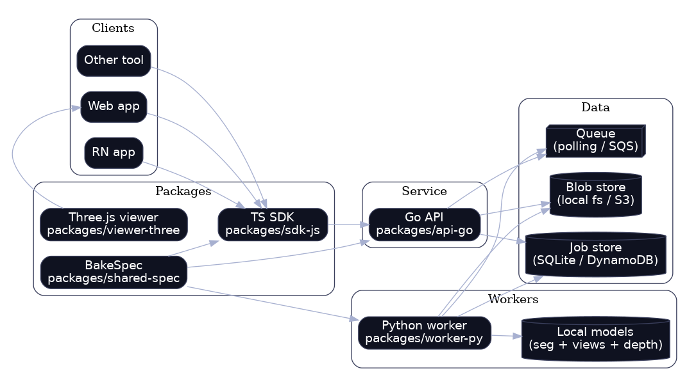
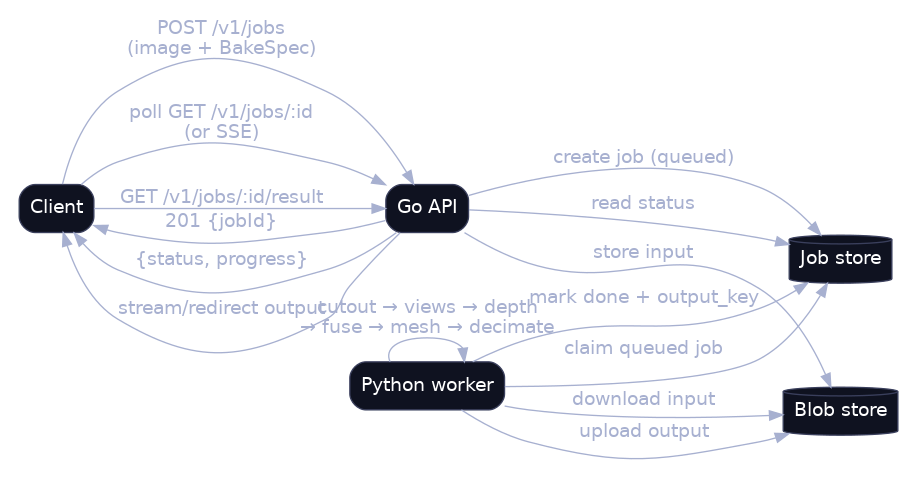
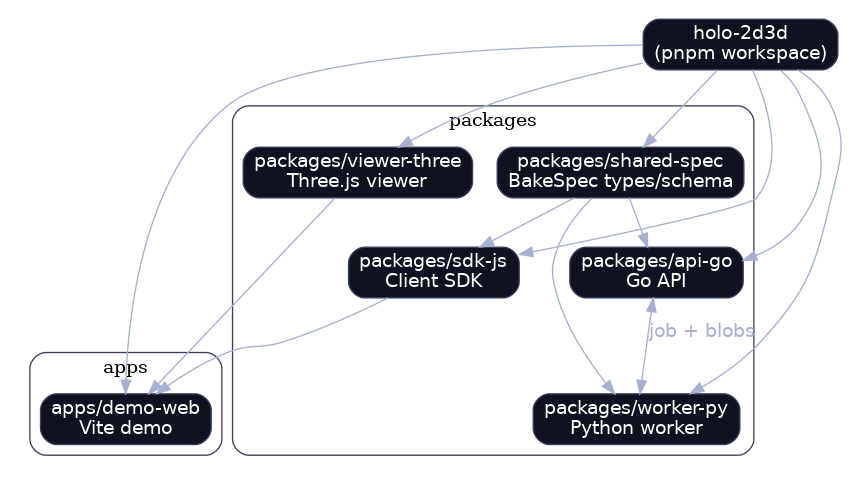
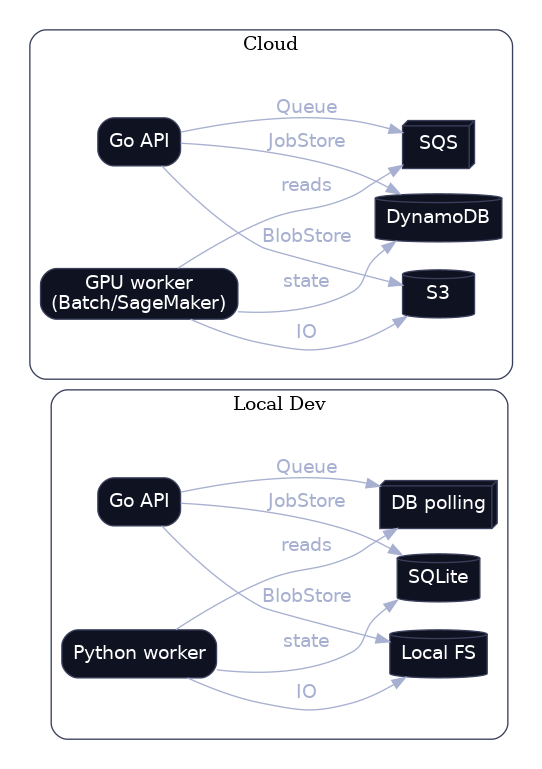

# Architecture

This scaffold uses a **job-based** design so heavy 2D→3D bakes can scale from local dev to cloud GPU workers.

## High-level components



## Job flow (async)



## Monorepo packages and boundaries



## Local vs deployed adapter swapping



## Notes

- The Go API talks to pluggable interfaces: `BlobStore`, `JobStore`, `WorkerBackend`, `Notifier`.
- In local dev, these can be filesystem + SQLite + a local Python worker.
- In the cloud, these can become S3 + DynamoDB + Batch/SageMaker Async + SNS/WebSocket.

---

### Regenerating diagrams

- Mermaid sources live in `docs/diagrams/*.mmd`.
- PNGs live in `docs/images/*.png`.

To regenerate PNGs from Mermaid (recommended once you have Docker):

```bash
./scripts/render-mermaid-pngs.sh
```

If you are fully offline, there's also a graphviz fallback (uses `docs/diagrams-dot/*.dot`):

```bash
./scripts/render-diagrams-dot.sh
```
