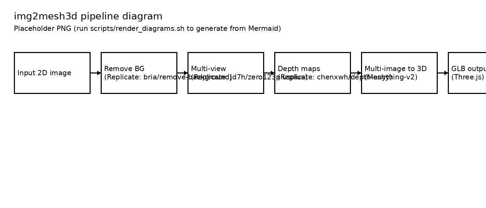

# Architecture

This package is intentionally split into:

- `img2mesh3d.clients.*` – thin wrappers for Replicate + Meshy
- `img2mesh3d.pipeline.ImageTo3DPipeline` – orchestration + artifacts
- `img2mesh3d.cli` – rich progress UI + local runs
- `img2mesh3d.api` – optional FastAPI wrapper

## Pipeline diagram

